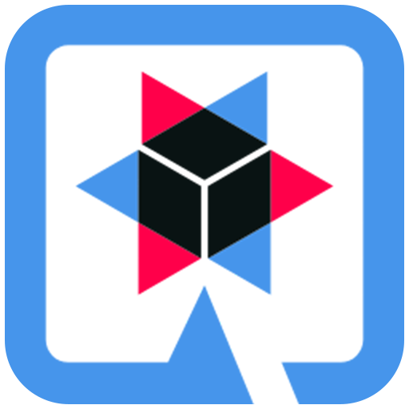

<h2>
	Hello. Welcome!
	
</h2>

<h3> About me:</h3>

- Java developer at IBM with experience in technologies such as Spring Boot, Quarkus, Git and SQL.
-
-

<table>
	<table>
		<thead>
			<tr>
				<th>Portuguese: Native</th>
				<th>English: B2</th>
				<th>Spanish: B2 </th>
			</tr>
		</thead>
		<tbody align=center>
			<tr>
				<td></td>
				<td></td>
				<td></td>
			</tr>
		</tbody>
	</table>
</table>

 

	<!--CONTADOR DE VIEWS-->
	 

	<!--PAINEL NOTA-->
	
	<!--PAINEL LINGUAGENS-->
	

##

<h3 align=center> 
	Tecnologias
</h3>

	<table>
		<tr align=center>
			<td width=155px>
				
			</td>
			<td width=155px>
			
			</td>
            <td width=155px>
	            
			</td>
			<td width=155px>
	            
            </td>
		</tr>
		<tr align=center>
			<td>
				
JAVA

			</td>
			<td>
				
SPRING

			</td>
            <td>
				
QUARKUS

			</td>
            <td>
				
SQL

			</td>
		</tr>
		<!--quebra de linha tabela-->
		<tr>
			<td colspan="5"></td>
		</tr>
		<!--quebra de linha tabela-->
		<tr align=center>
            <td width=155px>
	            
            </td>
			<td width=155px>
	             
            </td>
			<td width=155px>
	            
			</td>
			<td width=155px>
	             
            </td>
		</tr>
		<tr align=center>
			<td>
				
HTML

			</td>
			<td>
				
CSS

			</td>
			<td>
				
POSTMAN

			</td>
			<td>
				
GIT

			</td>
		</tr>
	</table>

##
	

 <!--Social-->
	<h3>Talk to me :)</h3>
	<a href="https://api.whatsapp.com/send?phone=5511973480829">
	
	<a href="https://www.linkedin.com/in/kelvin-marcondes/">
	
	<a href="mailto:kelvindesouza@hotmail.com">
	
	<a href="https://www.facebook.com/KelvinMarcondees">
	
	<a href="https://www.instagram.com/kelvinmarcondees/">
	

 <!--Social-->

##
